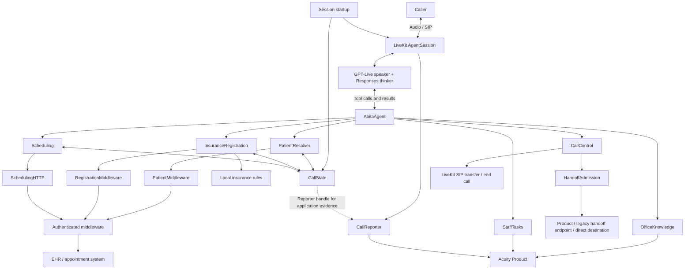

# Abita S2S architecture

A Python LiveKit worker for Abita's voice receptionist. One job owns one call:
one `AgentSession`, one `CallState`, and one shared HTTP client. GPT-Live handles
speech and turn-taking; its delegated thinker invokes the application tools.

## System map



Startup constructs the owners and injects their dependencies. The shared HTTP
client provides connection reuse; each adapter retains its own validation,
retry, and write-uncertainty rules. Product integrations and live SIP actions
depend on configuration and execution mode.

## Source ownership

| Module | Owns |
| --- | --- |
| [main.py](src/abita_s2s/main.py) | Environment loading and worker registration under `abita-s2s`. |
| [runtime/session_startup.py](src/abita_s2s/runtime/session_startup.py) | Office resolution, per-call composition, participant binding, session startup, mutation drain, and transport cleanup. |
| [agent.py](src/abita_s2s/agent.py) | Greeting, office-specific speaker instructions, and model-facing tool registration. |
| [model_config.py](src/abita_s2s/model_config.py), [prompts/](src/abita_s2s/prompts/) | GPT-Live speaker, delegated thinker, and their instructions. The thinker receives a fixed call-start Eastern timestamp. |
| [state.py](src/abita_s2s/state.py) | Call metadata, private lookup candidates, the canonical active patient receipt, patient revision, insurance state, and reporter handle. |
| [identity.py](src/abita_s2s/identity.py) | Phone candidates, first-name/DOB resolution, identity matching, lookup freshness, and verified patient activation. |
| [insurance.py](src/abita_s2s/insurance.py), [insurance_state.py](src/abita_s2s/insurance_state.py), [insurance_contract.py](src/abita_s2s/insurance_contract.py) | Backend insurance decisions, registration, insurance updates, and call-local readiness. |
| [scheduling.py](src/abita_s2s/scheduling.py) | Availability, private slot/appointment references, serialized mutations, receipts, appointment reconciliation, and scheduling outcomes. |
| [middleware.py](src/abita_s2s/middleware.py), [registration_middleware.py](src/abita_s2s/registration_middleware.py), [scheduling_http.py](src/abita_s2s/scheduling_http.py) | Separate adapters for patient reads, registration writes, and appointment operations. |
| [knowledge.py](src/abita_s2s/knowledge.py) | Office-scoped Product knowledge retrieval and result validation. |
| [staff_tasks.py](src/abita_s2s/staff_tasks.py) | Caller-approved staff requests, delivery receipts, and duplicate-delivery protection. |
| [call_control.py](src/abita_s2s/call_control.py), [handoff.py](src/abita_s2s/handoff.py) | Transfer admission, trusted destinations, SIP transfer, and ending the call. |
| [reporting.py](src/abita_s2s/reporting.py) | Ordered Product START/checkpoint/CLOSEOUT delivery, combining application evidence with the native session report. |
| [observability.py](src/abita_s2s/observability.py) | Post-call LiveKit judgments for completion, accuracy, tool use, and conciseness. |
| [offices.py](src/abita_s2s/offices.py), [config.py](src/abita_s2s/config.py) | Trusted office routing, greetings, capabilities, and runtime configuration. |

## Call lifecycle

1. **Resolve the office.** Real calls bind to the SIP participant and route from
   the trusted trunk number. Unknown trunks fail explicitly. Console sessions
   require an explicit office; simulations provide office context.
2. **Construct the call.** Create state, transports, the model, and tool owners.
   Start private phone lookup alongside the voice session so the greeting does
   not wait for patient data. Phone candidates do not activate a patient.
3. **Greet and work.** The speaker greets the caller. The thinker uses tools to
   resolve identity, register patients, check insurance, manage appointments,
   answer office questions, deliver staff requests, or transfer/end the call.
4. **Record observed outcomes.** Owners retain mutation evidence. When configured,
   the reporter sends Product checkpoints; scheduling responses and checkpoints
   use the same interpreted write outcomes.
5. **Close once.** Stop admitting work, invalidate outstanding reads, and drain
   accepted mutations within the shutdown deadline. Finish reporting, then close
   HTTP and SIP clients. Cleanup failures remain visible.

## State and mutation contracts

- **Identity:** lookup completion belongs to `PatientResolver`. Duplicate waiters
  share one shielded read; cancelling a waiter leaves it running. Corrections and
  shutdown invalidate its token so stale results cannot activate a patient.
  Resolution awaits the shared phone lookup, uses the caller's first name, and
  requests DOB only when needed. No startup lookup hint is sent to the model.
- **Field ownership:** `CallState.patient.active` is the canonical patient receipt.
  Identity owns verified identity activation; registration and insurance own
  their write results; scheduling owns appointment reconciliation. Read tasks,
  slot inventory, and mutation ledgers remain private to their owners.
- **Scheduling:** four tools hide availability and write coordination. Only
  returned references select slots or loaded appointments. Confirmed receipts
  update appointments through one reconciliation path, both after writes and
  after stale patient reloads. Backend identifiers and tokens stay private.
  Booking replay matches the selected slot; cancelled or replaced bookings never
  satisfy a new request. Fresh confirmed selections can create new appointments.
- **Rescheduling:** send one confirmed command to middleware. Middleware owns
  replacement booking, original cancellation, and provider
  reconciliation. Python applies completed/partial receipts to the captured
  patient and retains uncertainty without repeating writes. Appointment office,
  visit type, and action tokens come from middleware; missing authority requires
  a reload, never facility-text or provider-ID guessing.
- **Transport:** eligible patient reads have a bounded retry; scheduling writes
  are never automatically retried. Registration and staff delivery retain their
  own receipt and duplicate-handling policies.
- **Time:** the thinker uses the call-start date in `America/New_York`; it does not
  refresh across midnight. Scheduling validates dates against the current Eastern
  date and rejects same-day or past dates.

## Execution and verification

Configuration names live in [.env.example](.env.example). The worker loads
`.env.local` without overriding exported variables. Use Python 3.13 and uv:

```sh
uv sync --locked
uv run abita-s2s --help
ABITA_CONSOLE_OFFICE=spring-hill uv run abita-s2s console
uv run abita-s2s dev
uv run --no-sync python -m unittest discover -s tests -q
uv run --no-sync ruff check .
```

Console audio requires live credentials. Simulations require sandbox patient
middleware, disable Product writes and live SIP transfer setup, and retain any
configured read-only office knowledge endpoint. [Tests](tests/) exercise domain
behavior, HTTP contracts, and tool execution through `AgentSession` with offline
substitutes. They do not establish live model, audio, SIP, or provider behavior.

After Product closeout, calls with caller messages are evaluated through LiveKit
Inference using `openai/gpt-4o-mini`. The four built-in judges receive full text history,
including instructions and tool results; no separate judge API key is required
when LiveKit Inference is available to the project. Evaluation is bounded to 90
seconds within LiveKit's separate session-end budget. Results appear in LiveKit
Cloud as `lk.judge.<name>:pass|fail|maybe`, with explanations.

`abita.evaluation:complete` means all four judges returned, not that the call
passed. `incomplete` indicates missing results, an error, or timeout; `skipped`
means there were no caller messages. Review individual verdicts, including
`maybe`, rather than treating missing evaluations as successful calls. Judgments
do not independently verify backend state or audio quality. They are not added
to Product closeout or used to change patient records.

## Release path

[Verify](.github/workflows/ci.yml) checks pull requests and `main`. A successful
`main` push drives [Release Please](.github/workflows/release.yml). Merging its
release PR verifies the exact release commit, [publishes immutable
artifacts](.github/workflows/publish.yml), and [deploys the selected LiveKit
agent](.github/workflows/deploy.yml).

[release.py](src/abita_s2s/release.py) exposes agent, prompt, and eval identities.
Prompt and eval versions advance only when their content changes. Deployments
verify release identity and health; packaging an [eval suite](evals/) does not
execute it or establish live behavioral correctness.

Insurance participation is checked through middleware's `/api/insurance/decision`.
The agent retains the returned code, requirements and provider policy for the current
patient and coverage type. It does not bundle a plan catalog. Required referrals and
authorizations stay unverified until trusted backend evidence exists; callers cannot
clear them by saying they have one. Participation is not active individual coverage.

Deploy the middleware decision endpoint and `insuranceDecision` receipts before this
consumer. Missing or invalid decisions block registration/scheduling without a local
fallback. See the middleware `INSURANCE_CROSSWALK.md` for corrected carrier codes,
unresolved transport-ID mappings, source conflicts and integration dependencies.

### Scheduling contract verification

Deploy the middleware scheduling contract before this agent. No additional
infrastructure or deployment settings are required. Reschedule writes are sent
once; call-local receipts prevent repeated tool calls from repeating writes.
Partial or uncertain outcomes require staff reconciliation. There is no
persistent deduplication across calls or middleware restarts. Patient resolution
is unchanged.

To verify Python through the real middleware HTTP handlers with mocked provider
writes, run this from the matching middleware checkout:

```sh
PYTHON_SCHEDULING_WORKTREE=/absolute/path/to/abita_s2s go test ./internal/scheduling -run TestPythonSchedulingContract -v
```

The local-only runner is `tests/middleware_contract.py`. Middleware's
`docs/scheduling-ownership.md` describes receipt recovery and deployment limits.
