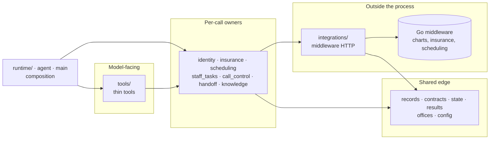
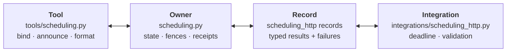

# Abita S2S

A Python LiveKit worker for Abita's voice receptionist. One job owns one call: one
`AgentSession`, one `CallState`, and one shared HTTP client. GPT-Live handles speech and
turn-taking; its delegated thinker calls the application tools.

**Agent-friendly means a correct edit to one file preserves the whole app's invariants.**
The design below exists so that an edit in the right folder cannot break a rule elsewhere.

## Five nouns organize the app

Each noun has one place in the tree and one job at runtime.

| Noun | Place | Job |
| --- | --- | --- |
| **Tool** | `tools/<name>.py` | What the model can call. Binds to the call, delegates, formats the answer. |
| **Owner** | `<name>.py` (`identity`, `insurance`, `scheduling`, `staff_tasks`, `call_control`, `handoff`, `knowledge`) | Per-call state and its rules. The one writer of its slice of `CallState`. |
| **Record** | `records.py`, `*_contract.py`, `state.py`, `results.py` | Typed shapes every layer shares: wire records, contracts, call state, tool results. |
| **Integration** | `integrations/<name>.py` | Authenticated middleware HTTP: deadlines, retries, response validation. |
| **Runtime** | `main.py`, `agent.py`, `runtime/` | Starts the call, wires owners to tools, reports and evaluates it, shuts down. |

## Layers are visible in the tree

A module's folder tells you where it sits and which imports are legal.


```mermaid
flowchart LR
  subgraph model["Model-facing"]
    tools["tools/<br/>thin tools"]
  end
  subgraph call["Per-call owners"]
    owners["identity · insurance · scheduling<br/>staff_tasks · call_control · handoff · knowledge"]
  end
  subgraph edge["Shared edge"]
    records["records · contracts · state · results<br/>offices · config"]
  end
  subgraph io["Outside the process"]
    integrations["integrations/<br/>middleware HTTP"]
    middleware[("Go middleware<br/>charts, insurance, scheduling")]
  end
  runtime["runtime/ · agent · main<br/>composition"] --> tools
  runtime --> owners
  tools --> owners
  owners --> integrations
  owners --> records
  integrations --> records
  integrations --> middleware
```

| Layer | May import | Must not import |
| --- | --- | --- |
| Foundation (records, contracts, state, offices, config) | the standard library and pydantic | integrations, owners, tools, runtime, `livekit.agents` |
| Integrations | foundation | owners, tools, runtime, `livekit.agents` |
| Owners | foundation, integrations, other owners | tools, runtime, `livekit.agents` |
| Tools | owners, foundation, `livekit.agents` | integrations, runtime, `httpx` |
| Observability | foundation, LiveKit transcripts | integrations, owners, tools, runtime |
| Composition (runtime, agent, main) | anything | nothing |

[tests/test_layers.py](tests/test_layers.py) assigns every module a layer and fails on an
import that points the wrong way.

## Feature blueprint

A feature is a vertical slice. Transport, durable state, and the model's view each live
in their named owner.


```mermaid
flowchart LR
  tool["<b>Tool</b><br/>tools/scheduling.py<br/>bind · announce · format"]
  owner["<b>Owner</b><br/>scheduling.py<br/>state · fences · receipts"]
  record["<b>Record</b><br/>scheduling_http records<br/>typed results + failures"]
  integration["<b>Integration</b><br/>integrations/scheduling_http.py<br/>deadline · validation"]
  tool <--> owner <--> record <--> integration
```

**The tool never handles HTTP, retries, state writes, or call startup.**

To add a capability:

1. Add or extend an owner that holds the state and rules, and takes plain arguments
   (`call_id=`, never a LiveKit `RunContext`).
2. Put the wire records next to their integration, or in `records.py` when several
   layers share them.
3. Add a tool in `tools/` that checks `bound(owner, context)`, speaks any announcement
   with `say_only()`, and returns the owner's answer.
4. Register the tool in `agent.py` and build the owner in `runtime/session_startup.py`.

## Decisions

- **One writer per state.** `identity` owns the patient and `insurance` grants
  acceptance. `identity` clears or rebinds acceptance only through `insurance_state`;
  `scheduling` writes only the active chart's appointment fields.
- **Writes are sent once.** Uncertain chart, insurance, and appointment writes are never
  retried; they block repeats for the rest of the call and go to staff.
- **Config owns the environment.** Only `config.py` and call startup read environment
  variables. Named LiveKit deployments are sandboxes: no human transfers, no Product writes.
- **Shutdown drains owners.** Startup closes admission on every owner, then waits for
  accepted writes before closing transports and delivering the Product closeout.
- **No code comments.** Intent lives in names and docstrings. Tool docstrings are the
  model's tool descriptions. [tests/test_no_comments.py](tests/test_no_comments.py)
  allows only shebangs and ruff `noqa` directives.

## Local development

Use Python 3.13 and uv. Configure `.env.local` (see [.env.example](.env.example));
exported variables take precedence. Console audio needs live credentials and an office.

```sh
uv sync --locked
ABITA_CONSOLE_OFFICE=spring-hill uv run abita-s2s console
uv run abita-s2s dev
uv run --no-sync python -m unittest discover -s tests -q
uv run --no-sync ruff check . && uv run --no-sync ruff format --check .
```

Deploy middleware contracts before their agent consumer. Offline tests and
[eval scenarios](evals/README.md) do not prove live audio, SIP, or provider writes.

## Post-call evaluation

After accepted writes drain, calls with caller messages are scored by `typesafe-ai/jev`
through Vercel AI Gateway (`AI_GATEWAY_API_KEY`). Each judge owns its definition in
[observability/judges](src/abita_s2s/observability/judges). Results go into Product's
closeout as `closeoutPayload.evaluation`, marked `complete`, `incomplete`, or `skipped`.
Evaluation failure never blocks closeout or changes the call outcome.

## Releases

The deployed agent has one version and Git commit. Each folder in
[component_folders.json](src/abita_s2s/component_folders.json) (`prompts/`, `tools/`,
`evals/`, `observability/`) also gets its own version and SHA-256 digest; an unchanged
folder keeps its previous version.
