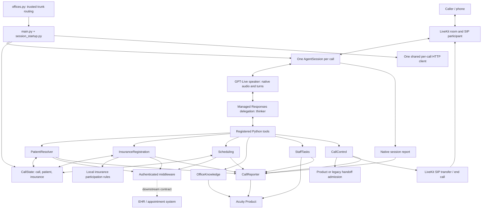

# Abita S2S architecture and implementation review

Reviewed September 16, 2026. Python baseline: `8ecbd81` (`main`). TypeScript checkout: `0e77f0f` (`codex/fix-incomplete-patient-search`), clean at review time; its local `origin/main` reference is `92cd9a1`. These are inspected local snapshots, not deployment claims. The TypeScript feature branch changes identity lookup to surname/DOB after phone lookup fails; its main still exposes firstName/DOB. Do not treat that branch change as an approved Python requirement.

## Judgment

**The Python architecture is substantially simpler and is the better foundation. It is not yet the cleanest complete replacement.** Keep the architecture; make narrow corrections to cancellation, runtime context, and documented parity. Do not translate the TypeScript state tree or introduce a generic workflow framework.

Python has 25 production Python source files / 4,338 lines versus 61 TypeScript source files / 12,763 lines (excluding `__tests__`, prompts, data, scripts, and dependencies). This is roughly 66% fewer source lines, not proof of equivalent functionality or better reliability. Different voice stacks and demo scope explain part of the difference.

## Findings and parity gaps

### 1. P2 — cancelling one shared identity read invalidates another caller

Evidence: [`identity.py:198`](../src/abita_s2s/identity.py#L198). Duplicate `resolve()` calls share `_task` and `_token`, but each waiter can clear the token and cancel that shared task. The surviving waiter then receives a misleading superseded result.

Reproduced with an offline HTTP transport: start two identical name/DOB resolutions, cancel the first while HTTP is pending, release the response. Actual result for the second: `superseded`, “Patient details changed”; active patient remains unset; only one HTTP request occurred. Expected: the remaining waiter completes verification. This is a domain-interface reproduction, not a demonstrated live voice incident. The existing duplicate-read test only covers both waiters completing.

Follow-up implemented locally: the resolver owns lookup completion. Identical callers share the shielded task; a cancelled waiter leaves the read running, even when no waiters remain. Token cleanup belongs to the lookup. Patient corrections and shutdown still invalidate stale results. This replaces the initial waiter-counting suggestion with a smaller implementation, removing `_await_resolution()` and two runtime lines. Regression coverage includes cancelling either duplicate waiter, the only waiter leaving, and shutdown with a transport that ignores cancellation.

### 2. P2 — relative-date interpretation lacks application-supplied clinic time

TypeScript [`agent.ts:89`](../../abita_agent/src/agent.ts#L89) injects current clinic-local time for each model turn, using `scheduling/clock.ts`. Python configures static speaker/thinker instructions and a startup phone hint; it does not supply equivalent date/time context. Python `Scheduling.availability()` knows Eastern “today,” but receives an already interpreted ISO date from the model.

“Next Friday” therefore depends on model/provider context the application does not establish. The default `startDate=None` is correctly grounded to tomorrow; an explicit future but incorrect date can pass the guard. This is a missing deterministic input, not a reproduced wrong spoken booking.

Follow-up implemented locally: append the call-start Eastern date, weekday, and time directly to the existing thinker instructions in `model_config.py`. No tool, timer, or date parser is added. Offline tests cover the actual constructor instructions across midnight and both DST transitions. The timestamp stays fixed during a call, so a call crossing midnight can retain an outdated relative-date reference; this limitation was explicitly accepted. Model date interpretation and live voice behavior remain unverified. Existing scheduling date validation is unchanged.

### 3. P2 parity decision — the explicit maximum call duration is missing

TypeScript installs a 30-minute call deadline through `runtime/call-duration-deadline.ts` and `runtime/call-closeout.ts`. Python has startup, HTTP, transfer, drain, and shutdown deadlines, but no application-owned total-call deadline. Disconnect/end-call cleanup is not equivalent to a maximum duration.

Restore one session-owned duration timer if this protection remains required. Record why it ended, close admission to new work, and let the existing closeout path finish. Provider limits may also exist; they were not verified and should not silently replace the application contract.

### 4. P3 — architecture documentation describes an earlier migration stage

README says transfers are not migrated, Product registration is future work, state contains only call/patient, and phone lookup runs in parallel with session startup. Current code includes `CallControl`, `CallReporter`, insurance state, and awaits `phone_lookup_context()` before `start_session()`.

Update those statements and link one current architecture map. This is an actionable maintainability issue: the README currently directs future implementation toward already-owned behavior.

## Design tradeoffs, not confirmed defects

- **Greeting latency:** Python waits for the phone hint before session startup (`session_startup.py:267–274`); patient reads have a ten-second total deadline. TypeScript also awaits phone lookup before starting its session. This is a shared tradeoff, not a newly lost behavior. Keep it if first-turn lookup context is mandatory; otherwise measure first-audio latency and overlap lookup with greeting through supported context delivery. Do not remove the hint blindly.
- **Scheduling depth:** `scheduling.py` is 942 lines; `_change()` owns booking, cancellation, and the two-step reschedule. Its private receipts, references, and serialized writes earn their complexity. However `_context()` reaches into many insurance internals, including object identity, and mutation control flow mixes validation, transport, state updates, reporting, and speech. First extract private operation-specific methods and a named immutable context value, only if that makes review easier. Keep one scheduling owner and one receipt ledger.
- **Ownership:** `CallState.patient.active` is canonical, but identity, insurance refresh, and scheduling update parts of that receipt. This is workable field-level ownership, not literally a single writer. Keep patient identity promotion owned by `PatientResolver`; document that scheduling owns appointment reconciliation. Avoid another copy of appointment inventory.
- **Transport repetition:** patient reads, registration writes, and scheduling writes repeat HTTP setup, but their retry and uncertainty policies differ. The small explicit adapters are preferable to a generic client that obscures whether a write is safe to retry.
- **Tool output consistency:** most patient/scheduling/knowledge results are plain text; staff and transfer results are JSON strings. Standardizing these is a small interface cleanup, not a reason to redesign domain receipts or Product reporting.
- **No fallback model/STT/TTS stack in Python:** fewer integrations and less orchestration, with greater reliance on native realtime behavior. Audio quality, multilingual turns, noise, interruptions, and outage handling require evidence before claiming parity.
- **Office scope:** Python maps five production offices and eleven trunk numbers. TypeScript also contains demo-office profiles and a New Tampa tool wrapper. Those are separate scope, not automatically missing production requirements.

## Checks that did not become findings

- The 180-second reporter finish deadline and 60-second worker shutdown setting initially appeared inconsistent. The installed LiveKit SDK runs `on_session_end` under a separate session-end timeout, before sending `ShuttingDown` and running shutdown callbacks. Therefore the numeric mismatch alone does **not** establish that normal closeout is killed at 60 seconds. Do not “fix” it by increasing a timeout without a failing lifecycle scenario.
- Accepted mutations are shielded and drained; uncertain appointment writes are not automatically repeated. Rescheduling books first, then cancels, retaining partial results. These are essential safety semantics, not removable bookkeeping.
- The existing receipt reconciliation prevents a refreshed patient read from erasing this call's observed appointment writes. Preserve it.

## Current system map

Solid arrows show implemented application relationships. External middleware and Product internals were not audited here. The EHR box indicates the intended downstream integration, not verified endpoint execution or production routing.



Handoff also supports a configured direct destination (Crystal River) without admission. HTTP consumers share the per-call client; the diagram omits individual client edges for readability. `CallState` also holds the reporter handle, which is an application dependency rather than patient data.

## Module and interface map

| Owner | Interface / responsibility | Private state or external contract |
|---|---|---|
| `main.py`, `runtime/session_startup.py` | Compose session, resolve office, register cleanup and session-end reporting | One job/call; one HTTP client; SIP API client; accepted-write drain |
| `model_config.py`, `agent.py`, prompts | Native speaker + managed thinker; register tools and request greeting | Provider owns speech/turn handling; app owns workflow instructions |
| `PatientResolver` | Resolve supplied identity, retain unverified phone candidates, promote validated receipts | Pending identity, freshness token, in-flight reads; `/api/patient/resolve` |
| `InsuranceRegistration`, `insurance_state.py` | Participation acceptance, readiness guard, create chart, update insurance | Local rules; `/api/add-patient`, `/api/patient/update-insurance`; pending/uncertain writes |
| `Scheduling` | Availability, book, cancel, reschedule | Private S/A references, inventory expiry, read generation, retained mutation receipts |
| `SchedulingHTTP` | Validate availability/write responses; never automatically retry mutations | `/api/scheduler/slots`, `/api/appointment/book`, `/api/appointment/cancel` |
| `OfficeKnowledge` | Read office-scoped facts without patient identifiers | Product knowledge endpoint; four-second deadline; no local-file fallback |
| `StaffTasks` | Validate and deliver approved work, recover exact duplicate delivery | Product `/v1/tasks`; payload-based idempotency; retained delivery tasks |
| `CallControl`, `HandoffAdmission` | Speak announcement, admit transfer, issue SIP request, fence retries/end-call | Trusted destinations; provider acceptance is not proof a human answered |
| `CallReporter` | START, appointment checkpoints, final native report + application receipts | Product `/v1/ai/interactions`; ordered sends and one finish task |
| Release scripts and workflows | Verify exact commits, publish immutable agent/prompt/eval bundles, deploy selected release | Component versions/hashes; deployment verification is separate from behavioral eval results |

Product integrations are optional/configuration-gated. Simulations use sandbox middleware and omit Product writes and live SIP transfer setup. Named deployment configuration also affects integration behavior; this map is not a claim that every arrow is enabled in a running worker.

## Main call and mutation sequence

```mermaid
sequenceDiagram
  participant C as Caller
  participant S as Session startup
  participant R as PatientResolver
  participant V as Speaker / delegated thinker
  participant A as Scheduling
  participant M as Middleware
  participant P as Product reporter
  S->>S: Resolve trusted office and create CallState
  S->>P: Queue START if configured
  S->>R: Start phone lookup
  R->>M: Read private candidate profiles
  M-->>R: Candidate evidence
  R-->>S: Non-identifying lookup hint
  S->>V: Start session and request greeting
  C->>V: Identify patient and request appointment change
  V->>R: resolve_patient(firstName, dob)
  R-->>V: Verified facts and loaded appointments
  V->>A: Find eligible availability
  A->>M: Read slots
  M-->>A: Expiring booking tokens
  A-->>V: Private slot references and spoken facts
  V->>C: Read back appointment details
  C->>V: Confirm
  V->>A: Reschedule with old and new references
  A->>M: Book replacement once
  M-->>A: Booking receipt
  A->>P: Queue checkpoint
  alt Booking verified and context still current
    A->>M: Cancel old appointment once
    M-->>A: Cancellation receipt
    A->>P: Queue combined checkpoint
  else Uncertain booking or changed context
    A->>A: Retain uncertainty or partial result; fence repeats
  end
  A-->>V: Both outcomes and next step
  V-->>C: Explain verified result or required staff help
  S->>S: On close: stop admissions and drain accepted writes
  S->>P: CLOSEOUT with native session report and retained facts
  S->>S: Close HTTP and SIP clients
```

## Comparison with abita_agent

| Concern | TypeScript | Python assessment |
|---|---|---|
| Voice pipeline | AssemblyAI STT, LLM fallback adapter, TTS runtime, language/turn/recovery hooks | Native GPT-Live audio + Responses thinker removes substantial application orchestration |
| State | Shared office/identity/insurance/workflow/availability/runtime tree | Smaller canonical state with private per-owner tasks and ledgers; better locality |
| Scheduling | Multiple modules plus shared state and appointment receipts | One owner plus HTTP adapter; simpler navigation, but long mutation method merits care |
| Patient identity | Main firstName/DOB; local feature branch changes fallback to surname/DOB | FirstName/DOB preserved; inspect desired policy separately from architecture |
| Knowledge | Product-backed office knowledge | Same high-level source-of-truth choice, small explicit adapter |
| Reporting | Custom event adapter and closeout machinery | Native session report plus application outcomes; substantially smaller implementation |
| Call protection | Explicit duration deadline and turn-local clinic clock | These application guarantees are missing or not established in Python |
| Deployment | Release/deploy pipeline | Agent/prompt/eval component identity retained; no deployment executed in this review |

## Smallest useful next changes

1. Completed locally after review: add the cancelled-duplicate-read regression and move lookup completion ownership to `PatientResolver`.
2. Completed locally after review: inject call-start clinic time. Still decide whether the existing 30-minute duration limit remains required.
3. Correct the stale README migration statements and use this map as the current source guide.
4. If scheduling remains hard to review, extract private book/cancel/reschedule helpers while preserving the existing receipt ledger and tests. Do not start a cross-repository rewrite.
5. Verify actual GPT-Live audio, interruption, late correction, transfer, uncertain-write, and Product visibility scenarios before declaring functional replacement parity.

## Verification

- `uv run python -m unittest discover -s tests`: **210 tests passed**.
- `uv run ruff check .`: **passed**.
- Additional offline cancelled-duplicate identity-read reproduction: **failure confirmed**, described above.
- Read both runtime implementations, workflow owners, state contracts, prompts, reporting, configuration, and relevant tests; inspected installed SDK shutdown ordering to reject an unsupported timeout finding.
- Did not run the TypeScript suite, live calls, provider APIs, production database checks, deployment, or model eval suites. No application code was changed by this review.
